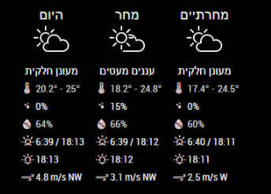

# MMM-3Day-Forecast
 OR 

This a module for the [MagicMirror](https://github.com/MichMich/MagicMirror/tree/develop).  This module shows a 3 day forecast (today, tomorrow and the day after) using the Wunderground API. It displays the overall weather condition, highest temperature, likely-hood of rain, average humidity, highest windspeed and its direction forecast.  This is designed to compliment the [MMM-Weather-Now](https://github.com/nigel-daniels/MMM-Weather-Now) module.<br>  
**Note:** This module used to use BitWeather but they reduced the free calls to an unusable amount :-( As of Oct 2022 the module has migrated to using the [Open Weather](https://openweathermap.org) API. The only thing you should need to change in the config is your `api_key` (See below).

## Installation
1. Navigate into your MagicMirror's `modules` folder and execute `git clone https://github.com/nigel-daniels/MMM-3Day-Forecast`.  A new folder `MMM-3Day-Forecast` will appear, navigate into it.
2. Execute `npm install` to install the node dependencies.

## Config
The entry in `config.js` can include the following options:

|Option|Description|
|---|---|
|`api_key`|**Required** This is the API key you need to use to request weather data from the Weather Underground site.  Details on how to request an API key can be found [here](https://openweathermap.org/home/sign_up)<br><br>**Type:** `string`<br>**Default value:** `null`|
|`lat`|This is the latitude of the location you want to get the weather for.<br><br>**Type:** `number`<br>**Default value:** `0.0`|
|`lon`|This is the longitude of the location you want to get the weather for.<br><br>**Type:** `number`<br>**Default value:** `0.0`|
|`units`|This is the units you want the weather reporting in.<br>**Type** `string` Use `M` for metric OR `I` for imperial.<br>**Default value:** `M`|
|`lang`|This is the two character country code for the language you want the weather in, see all the supported codes [here](https://openweathermap.org/forecast5#multi).\*<br><br>**Type** `string`<br>**Default value** `en`|
|`horizontalView`|This switches the look to use a more compact and horizontal view.<br><br>**Type** `boolean`<br>**Default value** `false`|
|`interval`|How often the weather is updated.<br><br>**Type:** `integer`<br>**Default value:** `900000 // 15 minutes`|

\* This module itself only currently supports `da`, `en`, `fr`, `de`, `it`, `nb`, `zh-tw`, `pt` and `nl` for the text 'Day after', 'Kph' and 'Mph'. Thanks for all of the translations. If you have translations for these please send them over and I'll add your language to the set I can support :)

Here is an example of an entry in `config.js`
```
{
    module:     'MMM-3Day-Forecast',
    position:   'top_left',
	config: {
		api_key:    'xxxxxxxxxxxxxxxxxxxxxx',
		lat:        37.3397352,
		lon:        -121.894958,
		units:      'M',
		lang:       'en',
		interval:   900000
	}
},
```

## Dependencies
Installed via `npm install`:
- [request](https://www.npmjs.com/package/request)
- [date-fns](https://www.npmjs.com/package/date-fns)
- [date-fns-tz](https://www.npmjs.com/package/date-fns-tz)

## Notes
I hope you like this module, I know it duplicates many other weather modules, however I missed my home-brew mirrors weather information so I recreated it for MM2.  Feel free to submit pull requests or post issues and I'll do my best to respond.

## Thanks To...
- [Michael Teeuw](https://github.com/MichMich) for the [MagicMirror2](https://github.com/MichMich/MagicMirror/tree/develop) framework that made this module possible.
- [Sam Lewis](https://github.com/SamLewis0602) whose [MMM-Traffic](https://github.com/SamLewis0602/MMM-Traffic) module I use and whose code I learnt a great deal from.
- [OpenWeather](https://openweathermap.org) for the helpful guides and information they publish on their API.
